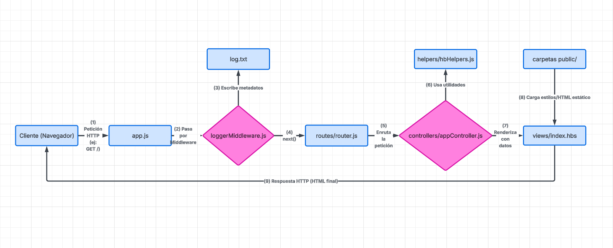
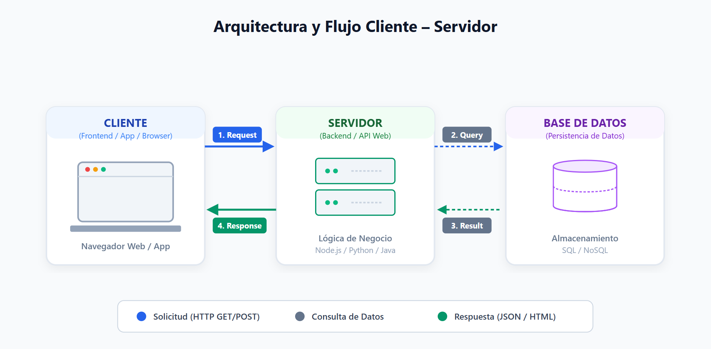
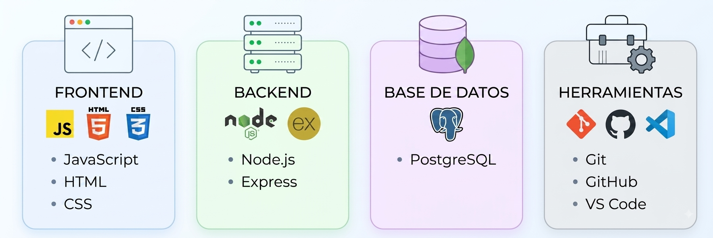

# Web App - Aplicación Node.js con Express y Handlebars

Aplicación web desarrollada con Node.js, Express y el motor de plantillas Handlebars (hbs). El proyecto incluye un sistema de registro de logs personalizado, modularización con arquitectura MVC (Model-View-Controller) básica y manejo de variables de entorno.

---

## 📋 Requisitos del Sistema

**Antes de comenzar, asegúrate de contar con los siguientes elementos instalados en tu sistema:**

- **Node.js** (versión 18.x o superior recomendada)
- **npm** (gestor de paquetes de Node.js, incluido al instalar Node)
- Un navegador web actualizado (Chrome, Firefox, Edge, (funcional en Opera GX ) etc. )

---

## 🛠️ Instalación y Configuración

Sigue estos pasos para ejecutar el proyecto en un entorno local:

1. **Clonar o descargar el repositorio:**

   ```bash
   git clone https://github.com/RenLEspinoza/Web-App.git
   cd web-app

   ```

2. **Instalar dependencias**

   ```bash
   npm install

   ```

3. **Configurar variables de entorno**

   Crear un archivo .env en la raiz del proyecto (ejemplo base)
   PORT=3000

4. **Ejecutar la aplicación:**

   Modo desarrollo(con auto-reload vía nodemon):

   ```bash
   npm run dev
   ```

   Modo producción

   ```bash
   npm start
   ```

   **Una vez iniciada, la aplicación estará disponible en http://localhost:3000.**

## 🚀 Ejemplos de Uso y Rutas

    **La aplicación cuenta con las siguientes rutas funcionales:**
    Método,         Ruta,               Descripción,                                                    Tipo de Respuesta
    GET,            /,                  Página de inicio dinámica con estado del servidor.,HTML         (Render Handlebars)
    GET,            /dashboard,         Panel dinámico de administración de usuarios.,                  HTML (Render Handlebars)
    GET,            /status,            Estado operativo del servidor y marca de tiempo.,               JSON

**Ejemplo de Respuesta JSON (/status):**

```JSON
{
  "estado": "OK",
  "codigo": 200,
  "mensaje": "El servidor está funcionando correctamente",
  "timestamp": "2026-08-14T16:45:00.000Z"
}
```

## 📁 Estructura del Proyecto

```text
web-app/
├── controllers/
│   └── appController.js      # Lógica de negocio y renderizado de vistas
├── helpers/
│   └── hbHelpers.js          # Helpers personalizados para Handlebars
├── middlewares/
│   └── loggerMiddleware.js   # Middleware para auditoría y registro en log.txt
├── public/
│   ├── styles.css            # Hojas de estilo estáticas
│   └── prueba.html           # Recurso HTML estático
├── routes/
│   └── router.js             # Definición centralizada de rutas (Extra)
├── views/
│   └── index.hbs             # Plantilla principal de Handlebars
├── .env                      # Variables de entorno
├── .gitignore                 # Archivos excluidos de Git
├── app.js                    # Punto de entrada principal de la aplicación
├── log.txt                   # Registro plano de eventos y accesos
└── package.json              # Configuración y dependencias del proyecto
```

### 🗺️ Flujo de navegación Web App



## 🏛️ Justificación y Reflexión Técnica

### 📁 Diseño Arquitectónico y Estructura de Directorios

**Adopción del Patrón MVC (Modelo-Vista-Controlador)**: La estructura del proyecto se organizó siguiendo el patrón arquitectónico **MVC** para garantizar una clara separación de responsabilidades. El enrutamiento se centraliza en routes/router.js, las peticiones y la lógica de flujo se gestionan en controllers/appController.js, y la interfaz gráfica del usuario se delega a las plantillas dinámicas en views/index.hbs, utilizando Handlebars como motor de renderizado del lado del servidor.

**Desacoplamiento de Archivos Estáticos**: El uso del directorio public/ para el manejo de recursos estáticos (styles.css y prueba.html) asegura que los activos del frontend se sirvan de forma independiente y eficiente a través de los middlewares nativos de Express, sin interferir con las rutas lógicas del sistema.

**Configuración y Seguridad**: Se incluyeron archivos de configuración esenciales como .env para la abstracción de variables de entorno (protegiendo credenciales y puertos de forma segura) y .gitignore para evitar la subida accidental de dependencias pesadas (node_modules) al control de versiones.

### 📋 Implementación de Middleware y Trazabilidad (Auditoría)

**Principio de Responsabilidad Única mediante Middlewares**: El registro de visitas y telemetría de la aplicación se resolvió de forma transversal mediante la creación de middlewares/loggerMiddleware.js. Esta decisión de diseño evita duplicar código dentro de las funciones del controlador y garantiza que cada petición entrante sea interceptada y procesada automáticamente.

**Sistema de Persistencia de Logs (log.txt)**: El middleware extrae de cada petición HTTP metadatos críticos como la **fecha**, **hora**, **evento**, **tipo** y **ruta de acceso** (método HTTP / acción). Los datos se escriben de manera persistente en el archivo de auditoría log.txt. En el contexto futuro de una wallet digital, esta funcionalidad representa el núcleo inicial del sistema de seguridad, auditoría y análisis de comportamiento de usuarios requerido por normativas técnicas.

- **Modularidad con Helpers**: La creación de helpers/hbHelpers.js permite aislar funciones utilitarias específicas (por ejemplo, formateadores de fechas o textos para Handlebars), manteniendo los componentes principales limpios y enfocados en sus tareas primarias.

### ✨ Justificación de Node.js + Express

**Modelo Asíncrono y de un Solo Hilo:** Node.js maneja las peticiones de forma no bloqueante (I/O asíncrono). Esto lo hace ideal para aplicaciones web modernas que manejan muchas conexiones simultáneas con un consumo mínimo de memoria.

**Unificación de Lenguaje:** Usar JavaScript tanto en el servidor (Node.js) como en el navegador (Frontend) reduce la carga cognitiva del equipo. Permite compartir lógica, tipos de datos y validaciones fácilmente.

**Express como Framework Minimalista:** Express no impone una estructura rígida. Te da la libertad de implementar la arquitectura que prefieras (como MVC o Capas) mediante el uso de middlewares, sin añadir código innecesario ("bloatware").

**Ecosistema NPM:** Tienes acceso al catálogo de librerías más grande del mundo. Esto acelera el desarrollo al no tener que reinventar la rueda para tareas como autenticación, seguridad o conexión a bases de datos.

### ✨ Justificación de log.txt y NO una base de datos para los registros

Para esta primera etapa de infraestructura base, un flujo de escritura en archivo de texto plano (log.txt) minimiza la sobrecarga del servidor y nos permite validar el funcionamiento del middleware sin introducir dependencias externas. En las siguientes fases de desarrollo (de ser usuarios y cuentas), este flujo se migrará hacia un sistema de base de datos indexado para facilitar consultas complejas de auditoría.

### ✨ Justificación de Eventos Registrados en log.txt

Además de registrar cada acceso a las rutas HTTP (que permite auditar el tráfico y comportamiento de los usuarios), se decidió registrar el evento de inicio del servidor (INICIO_SISTEMA).
**Motivación:** En entornos de producción, registrar el ciclo de vida del servidor permite a los administradores correlacionar posibles fallas, caídas o reinicios con las peticiones entrantes. Distinguir entre eventos del sistema y accesos de usuarios proporciona una trazabilidad más completa en el archivo de auditoría plano.
**Extras:** Con la misma lógica se podrían registrar eventualmente otro tipo de movimientos, por ejemplo errores o validaciones.

### ✨ Justificación de Scripts de ejecución

Se configuró **npm start** como el comando estándar de producción para arrancar la aplicación directamente con Node. Para el entorno de desarrollo se configuro **npm run dev** asociándolo a **nodemon,** optimizando así el flujo de trabajo al evitar reiniciar manualmente el servidor tras cada modificación.

### 🔌 Extra. Estructura de Ruteo Modularizada

**Ruteo Modularizado:** Se creó de forma externa la estructura de ruteo modularizada utilizando express.Router() en el archivo ./routes/router.js. Las rutas fueron importadas y conectadas de forma limpia en el servidor principal (app.js) utilizando app.use("/", routes);.

## 📷 Screens entregables

### Flujo Básico Cliente - Servidor



### Flujo del proceso

**Petición (Request):** El cliente realiza una solicitud HTTP (GET, POST, PUT, DELETE) con cabeceras y/o datos.

**Procesamiento en Express:** El servidor recibe la petición, la pasa por los middlewares (logs, seguridad, parseo de JSON) y la entrega al manejador de la ruta correspondiente.

**Respuesta/Resultado (Response/Result):** El servidor procesa la lógica de negocio (consultando si es necesario a una BD) y devuelve un estado HTTP junto con los datos solicitados (generalmente en formato JSON).

**Nota:** Si bien en este ejemplo see utiliza como referencia una base de datos pensando a futuro, en esta etapa de desarrollo, como fue mencionado anteriormente, se utilizo un archio log.txt para la persistencia de datos.

### Infografía Stack Técnico del Proyecto



**Nota:** En la infografía se agrego en base de datos PostgreSQL, aunque no se utilizo en lo práctico en esta etapa del desarrollo (ya que se utilizo un archivo log.txt para la persistencia de datos), esta considerado para ser implementado en las siguientes etapas.

---

## 🤖 Declaración de Uso de IA y Referencias

El desarrollo del proyecto se basó primordialmente en los contenidos, arquitecturas y ejemplos prácticos vistos durante las clases del módulo 6.

### Uso de Inteligencia Artificial (Gemini)

Se utilizó la herramienta **Gemini** como asistente técnico de apoyo puntual para:

- **Consultas conceptuales y sintaxis:** Resolución de dudas rápidas sobre configuraciones de Express y sintaxis de Handlebars.
- **Formato y documentación:** Estructuración y revisión del archivo `README.md` (formato Markdown, tablas y alineación de diagramas).
- **Reflexión técnica:** Apoyo en la redacción y síntesis de las justificaciones arquitectónicas del backend.
- **Exepción para helpers:** El código del helper para visualización de status del servidor (con color) si fue pedido a la IA de Gemini.

> **Nota:** No se generaron componentes completos ni lógica de negocio crítica de forma automatizada; el código fue escrito, probado e integrado manualmente siguiendo la pauta del proyecto.

---
